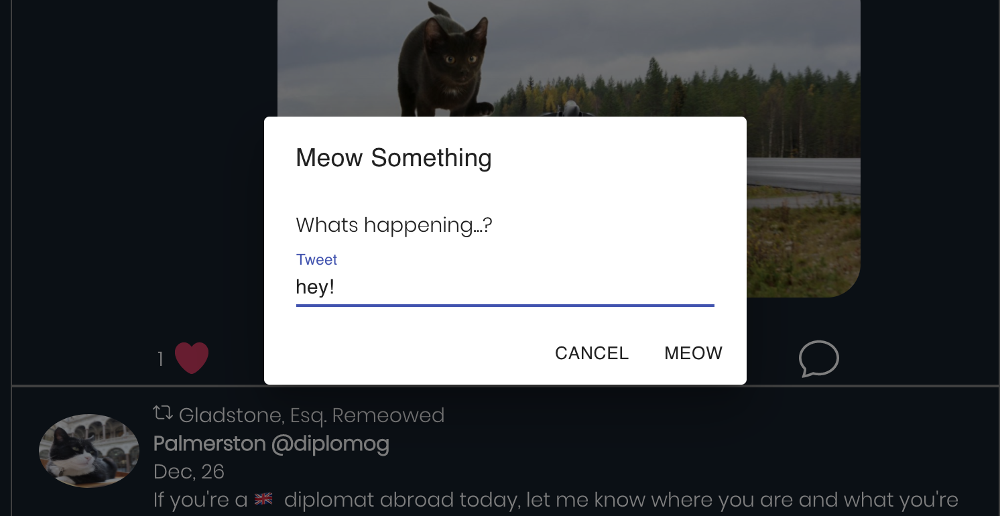
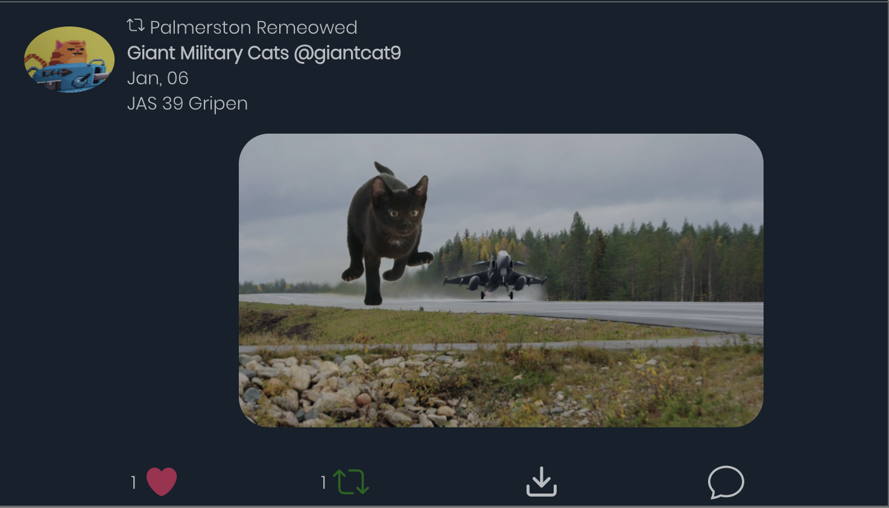
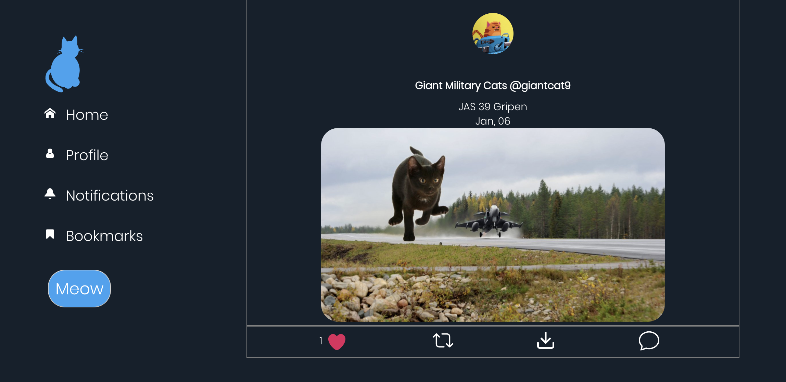
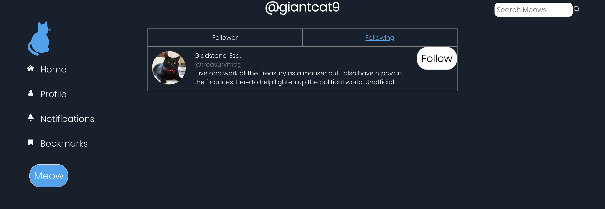

### Twitter Clone Project
Twitter clone but a cat theme! Users can meow(tweet) , see other users profiles, like, retweet and follow other profiles!
User logged in as: Gladstone - treasurymog
### Getting Started
These instructions will get you a copy of the project up and running on your local machine for development and testing purposes.

Go to the server directory. Run npm install/yarn install followed by npm start/yarn start. The server will be running on port 31415

Go to the client directory. Run npm install/yarn install followed by npm start/yarn start. Accept to listen to FE on port 3000

### Flow for user.

## Home
### Home Page

## Tweet
### Users can tweet by clicking on either MEOW buttons.

## Like & Retweet
### Users can like and retweet other tweets.

## Tweet Details
### Users can see more details about a particular tweet.

## User profiles
### Users can click and see other users profiles.

## Followers/Following
### Users can follow and unfollow other users.

## Search bar
### Users can search for tweets based on content and then click to see more details.

## Responsive Design

### Known Error:
-A known issue is after unfollowing a user, then trying to retweet something that user said, and then clicking on the profile page. There will be an error on the profile page because, that user no longer exists in state. 

### Prerequisites
-node.js, npm/yarn

### Built With
Node.js - Backend
React - FrontEnd

### Authors
Manider Dheer.
Josh Commeau - Back End.

### License
This project is licensed under the MIT License - see the LICENSE.md file for details

### Acknowledgments
Big thank you to Scott and Josh!
